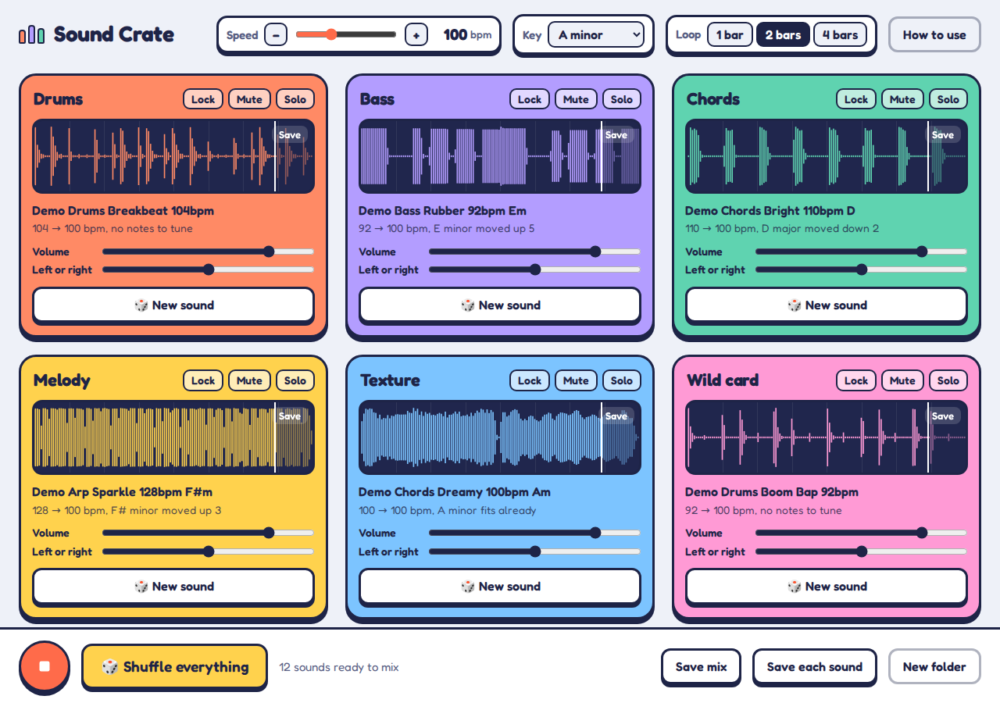

# Sound Crate

A sample-flipping music app for a Chrome browser.

Point it at a folder of sounds you forgot you had. Sound Crate listens to every file, works out its speed and key, then stretches and tunes six of them so they play together as a loop. Keep shuffling until something clicks.

## Use it

**Online:** open https://mattsimoto.github.io/sound-crate (once GitHub Pages is turned on, see below).

**Offline on a Mac:** download `index.html`, rename it `Sound Crate.html` if you like, and double-click it. It opens in Safari or Chrome. To keep it handy, drag the file onto the right side of the Dock.

Your sounds are never uploaded anywhere. Everything happens inside the browser on your Mac.

## What it does

- Choose a sound folder, choose some files, or drop a folder onto the window
- Try the built-in demo sounds if you don't have any files yet
- Six slots: Drums, Bass, Chords, Melody, Texture and Wild card
- Every sound is stretched to one speed and tuned to one key
- Each slot has New sound, Lock, Mute, Solo, volume and left-or-right
- Change the speed (70–160 bpm), the key, and the loop length (1, 2 or 4 bars)
- Save the mix as a WAV file, or save each sound on its own
- In Chrome, drag a slot's Save tab straight into GarageBand

Shortcuts: **Space** plays or stops, **R** shuffles everything.

## Good to know

- Works best with music loops. File names that include the tempo and key, like `Bass_120bpm_Am.wav`, make it more accurate.
- Sounds shorter than 1.5 seconds are skipped.
- Reads .wav, .aif, .mp3, .m4a, .flac, .ogg and .caf files.
- Dragging sounds out of the app only works in Chrome. In Safari, use Save each sound instead.

## How it works

It's one HTML file with no dependencies, using the Web Audio API.

1. **Tempo:** finds the loud hits in each sound and looks for a repeating pattern. If the file is a clean loop, its length in bars is used to pin the exact tempo. A tempo in the file name wins over both.
2. **Key:** measures how much of each of the 12 notes is in the sound and compares that to typical major and minor key patterns.
3. **Role:** guesses drums, bass, chords and so on from the file name, or from how bright and how tuneful the sound is.
4. **Fitting:** cuts a bar-aligned chunk, time-stretches it with WSOLA so the speed matches, resamples it to shift the pitch into the chosen key, then evens out the volume.

## Credits

Inspired by [Upcycle](https://arialabs.io/upcycle) by Aria Labs. If you make music on a Mac and want the real thing, go get it. Sound Crate is an independent learning project and isn't affiliated with Aria Labs.

## Version history

- **1.0.0** — first version
