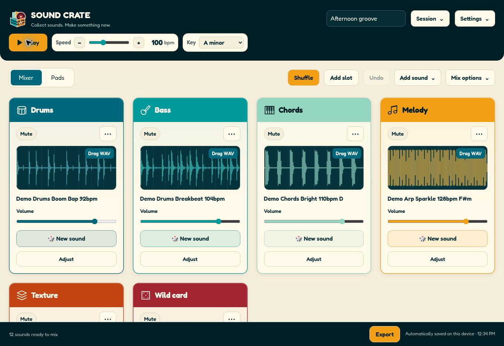

# Sound Crate

**Collect sounds. Make something new.**

Sound Crate turns forgotten samples, microphone recordings, and everyday noises into a playable mix. Load a collection, shuffle sounds into the mixer, and fit them to a shared tempo and key. Built for quick experiments, music lessons, and getting an idea into your DAW.

**[Open Sound Crate →](https://mattsimoto.github.io/sound-crate/)** · Web app and Mac desktop app · Current version: **1.5.1**



## Make your first mix

1. Open the app and choose **Try the demo sounds**, or add your own audio files or folder.
2. Press **Play**, set the **Speed** and **Key**, and use **Shuffle** until something clicks.
3. Click a waveform to choose a sound. Use **New sound** to replace it, **Adjust** to shape it, and **⋯** for more slot options.
4. Open **Export** to download a mix, stems, or a portable project.

Your audio is processed locally in your browser or desktop app. Sound Crate does not upload your sounds.

## What you can do

| Feature | How it works |
| --- | --- |
| Flexible mixer | Start with Drums, Bass, Chords, Melody, Texture, and Wild card. Use 1–12 slots, with no more than four across. |
| Find a combination | Shuffle, lock keepers, mark favorites, choose source folders, and try a different slice of a sample. |
| Shape each slot | Volume, pan, mute, solo, gain, octave, half/double time, a 16-step gate, and four-bar repeats. |
| Better sound fitting | Correct source tempo and key, choose a start offset, and shift pitch independently of tempo. |
| Simple effects | Echo, Reverb, Filter, and Crunch, with bypass for comparison. |
| Record and trim | Capture a laptop or USB microphone, trim the take, remove edge silence, and add fades. |
| Playable pads | Assign eight sounds, play them with the keyboard, and record a performance into your collection. |
| Keep your work | Undo/redo, named saved sessions, portable projects, and automatic recovery. |
| Choose your look | Retro record-shop branding, colored instrument slots, and light/dark modes in **Settings**. |

The main controls stay visible. **Session** handles projects and saved sessions; **Add sound** handles imports and recording; **Mix options** holds loop length and extra mixer controls.

## Built-in sample packs

The demo collection now contains **38 sounds**: 12 music loops, 8 synthetic voice samples, 10 ambient textures, and 8 synthesized brass phrases. **Add sound** lets you add each pack to the current collection without replacing your mix. Adding the same pack again skips sounds already present.

- **Voice:** vowel chops, call-and-response tones, stutters, pulses, choir, hum, whisper rhythm, and vowel conversation. These are synthesized vocal textures, not recordings of a person speaking.
- **Ambient:** soft rain, wind, surf, birds, insects, vinyl noise, rumble, creek, space drift, and warm air. These are procedurally generated soundscapes.
- **Brass:** trumpet fanfare, muted trumpet, trombone groove, French horn call, tuba march, section stabs, horn swell, and low ensemble. These are synthesized approximations.

All built-in sounds generate locally and work with fitting, effects, pads, recovery, and exports. Use each pack's source-folder filter in a slot to focus your selections.

For recorded brass, see [additional sample sources](docs/sample-sources.md), then download and use **Add sound → Import files**.

## Record something

Choose microphone recording from **Add sound**. Enable microphone access, select your laptop or USB input, and check the meter. Record a take, stop, preview it, then open **Edit** for trim points, silence trimming, and fade controls.

Name the take, choose its role and destination, and add it to the collection. Short hits such as claps and taps are supported. Download the original or edited WAV if you want a separate copy. Microphone takes are limited to two minutes.

Recording requires microphone permission and the HTTPS web app or desktop app. After connecting a new USB input, refresh the microphone list.

## Play the pads

Switch to **Pads** and assign sounds from your collection. Pads play original one-shot sounds rather than fitted mixer loops. Record up to 60 seconds of pad playing, then add the performance as a new sound.

| Shortcut | Action |
| --- | --- |
| Space | Play / stop the mixer |
| R | Shuffle unlocked slots |
| A, S, D, F / J, K, L, ; | Play the eight pads |
| Ctrl/Cmd + Z | Undo |
| Ctrl/Cmd + Shift + Z | Redo |

## Fit and finish a sound

Open **Adjust → Sound fitting** when a sample's detected tempo or key needs correcting. Filename hints such as `Bass_120bpm_Am.wav` help; audio estimates are approximate. You can enter the source tempo and key, disable tuning, move the start point, and add an extra semitone shift.

**Auto** uses beat slices for drums to preserve attacks and smooth stretching for sustained sounds. You can also select either fitting method manually. Pitch shifting changes pitch; it does not turn a major recording into a minor one.

**Simple effects** adds half-beat Echo, small-room Reverb, a low-pass Filter, and Crunch distortion. Effects are included in fitted loops, WAV exports, and desktop DAW drags. Echo and reverb wrap within the loop so stems remain aligned. Use **Bypass effects** to compare.

## Save, recover, and export

- **Saved sessions:** keep named mixes on this browser or desktop profile.
- **Save project:** download a portable `.soundcrate` file with selected source sounds, pad assignments, fitted loops, and mixer settings. Open it on another installation without needing the original source folder. The project limit is 200 MB.
- **Automatic recovery:** periodically saves the full collection, pads, and settings on this device. After reopening, restore or discard the recovery offered by the app.
- **Export:** download a 4/8/16/32-bar mix or equal-length stem WAVs. Dry stems include occupied slots; mixed stems respect mute/solo, volume, pan, and gain. Mix export also includes master processing.

Portable projects keep selected mixer and pad sounds rather than the whole imported collection. Reload the original folder to explore its other sounds. Clearing browser/app data removes local sessions and recovery, so keep a project file for a durable backup.

## Mac desktop app

The Electron app supports native WAV dragging into compatible DAWs. Drag a slot's **Drag WAV** tab, or use the stem-drag option in **Export**. Browser downloads are the reliable alternative when native dragging is unavailable.

Download DMG/ZIP builds from a successful [Build Sound Crate for Mac workflow run](https://github.com/mattsimoto/sound-crate/actions/workflows/desktop.yml), under **Artifacts → Sound-Crate-Mac**. Builds target Apple Silicon and Intel Macs. They are unsigned and not notarized, so macOS may block first launch.

Native drag acceptance and microphone behavior still need hands-on testing in Mac DAWs.

## Run and develop

The web app lives in `index.html` and uses the Web Audio API. Open it in a modern browser for file-based mixing, or use the hosted HTTPS app for recording.

With Node.js installed, run the desktop app:

```sh
npm ci
npm start
```

Run regression checks:

```sh
npm test
```

On a Mac, run the recording smoke check or build installers:

```sh
npm run test:recording
npm run dist:mac
```

Tests cover project compatibility, recovery, mixer controls, fitting, effects, and aligned exports. Simulated UI checks complement real listening and native device testing.

Imports accept WAV, AIFF, MP3, M4A, FLAC, OGG, and CAF; actual decoding depends on the browser. Musical loops generally fit best. See [feature coverage and validation limits](docs/feature-coverage.md) for more detail.
